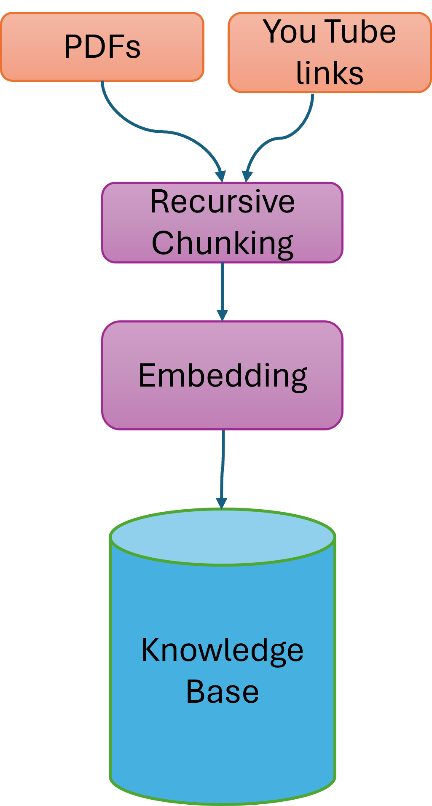

# Mini RAG-Powered Assistant

## Project Objective
The goal of this project is to design and implement a basic Retrieval-Augmented Generation (RAG) assistant that can answer user questions using a custom document corpus. The problem statement focuses on building an AI assistant that can accurately answer user questions from large amounts of data such as PDFs and web content. Traditional keyword search is inefficient, and using a pure language model can lead to hallucinated or unreliable answers.

By this project we as a team demonstrates our hands-on understanding of:

- Generative AI concepts  
- Retrieval-Augmented Generation (RAG)  
- Vector databases and semantic search  
- LLM integration  
- AI-assisted development tools (GitHub Copilot)
- Our creative ideas
- End to end Pipeline
- Deployment

---

## Key Features & Architectural Highlights

This project implements a state-of-the-art RAG pipeline optimized for real-world interaction, transparency, and multi-format intelligence.

### 1. Multilingual Response (Cross-Lingual Support)
* **The Problem:** Knowledge bases are often in English, but users may speak Hindi, Spanish, or French.
* **Our Solution:** The system uses a **Cross-Lingual Chain**. It accepts queries in any language, translates them to English for retrieval against the database, and generates the final response back in the user's native language, breaking language barriers.

### 2. Citation & Transparency Work
* **The Problem:** Users do not trust "black box" AI models that hallucinate facts.
* **Our Solution:** We enforce **Strict Evidence Binding**. Every response includes an expandable "Source" tab that links directly to the specific document name and page number used, ensuring 100% auditability and trust.

### 3. YouTube Context Integration
* **The Problem:** Valuable information is often locked inside video tutorials or recorded meetings, inaccessible to text search.
* **Our Solution:** The pipeline integrates `YouTubeAudioLoader` and OpenAI Whisper. It downloads audio, transcribes it into text, and indexes the transcript with timestamps, allowing users to "search" inside videos.

### 4. Query Expansion Layer
* **The Problem:** Users often ask vague or overly simple questions (e.g., "slow wifi") that miss technical keywords.
* **Our Solution:** We use an intermediate LLM step to **decompose and expand** the query. The system generates synonyms and sub-questions (Hypothetical Document Embeddings) to broaden the search scope and drastically improve retrieval recall.

### 5. Multi-Modal Retrieval (Images & Tables)
* **The Problem:** Critical data is often trapped in charts, infographics, or scanned tables within PDFs.
* **Our Solution:** The ingestion pipeline utilizes **OCR (Optical Character Recognition)** and multi-modal models to extract text from images and structure tables into JSON before embedding, ensuring no data is left behind.

### 6. Intelligent Summarization
* **The Problem:** Users don't always have time to read detailed answers; sometimes they need a "TL;DR" of a 50-page report.
* **Our Solution:** We implemented a **Map-Reduce Summarization Chain**. The system can take large sets of retrieved documents and recursively condense them into a concise executive summary without losing key details.

### 7. Conversation Memory (Session State)
* **The Problem:** Standard RAG systems treat every question as a new interaction, failing to understand "What about the second point?"
* **Our Solution:** We maintain a `ConversationBufferMemory`. The system rephrases follow-up questions into standalone queries using the previous chat history, ensuring a smooth, context-aware conversational flow.

### 8. User Feedback Loop (RLHF Lite)
* **The Problem:** Developers rarely know when the RAG system fails or gives a bad answer.
* **Our Solution:** We included a **Thumbs Up/Down** feedback mechanism. Negative feedback logs the query and retrieved context to a file, creating a dataset for future fine-tuning and system improvement (Reinforcement Learning from Human Feedback).

### 9. Auto-Generated Follow-Up
* **The Problem:** Users often don't know what to ask next after getting an answer.
* **Our Solution:** After generating a response, the LLM analyzes the context to suggest **3 relevant follow-up questions**. This guides the user deeper into the document and improves engagement.

---

## Project Structure
```
Document_RAG/
├── app/
│   ├── requirements.txt
│   ├── main.py
│   ├── utils/
│   │   ├── embeddings.py
│   │   ├── pdf_processor.py
│   │   ├── gemini_api.py
├── .gitignore
├── .venv
```

## System Architecture

The system follows an advanced RAG (Retrieval-Augmented Generation) Pipeline as illustrated in the technical flow:

1. Data Ingestion & Indexing  
   - Multi-Source Input: The system ingests data from multiple formats, specifically PDFs and YouTube links.  
   - Recursive Chunking: Raw text is processed through a recursive chunking strategy to maintain structural context.  
   - Vector Embedding: Chunks are transformed into high-dimensional vectors using an Embedding Model.  
   - Knowledge Base Construction: These embeddings are stored in a centralized Knowledge Base (Vector Store) for efficient retrieval.  

2. Retrieval & Context Processing  
   - Query Transformation: User queries are processed (and embedded) to align with the Knowledge Base.  
   - Context Retrieval: The system performs a similarity search to pull the most relevant "Retrieved Context" from the Knowledge Base.  
   - Hybrid Search: (As per your code) Combining semantic vector search with keyword-based retrieval.  

3. Response Generation  
   - Generator (LLM): The Retrieved Context is fed into the Generator (Gemini 1.5 Flash) along with the original query.  
   - Context-Aware Response: The Generator synthesizes the information to produce an accurate, cited Response.  
   - Feedback Loop: The response is delivered to the user, with the chat history being maintained to inform future queries.  


### High-Level Flow

User Query → Retriever → Vector Database → Relevant Context → LLM → Final Answer

**Figure 1: High-Level RAG Architecture**

<figure>
  
  <figcaption>High-Level RAG Architecture Diagram</figcaption>
</figure>


**Figure 2: Retrieval and Generation Flow**

<figure>
  
  <figcaption>Retrieval and Generation Flow</figcaption>
</figure>


---

## Technology Stack

- **Programming Language:** Python  
- **LLM:** OpenAI / HuggingFace (configurable)  
- **Embedding Model:** OpenAI / HuggingFace embeddings  
- **Vector Store:** FAISS  
- **Framework:** LangChain  
- **Version Control:** GitHub  
- **UI:** Streamlit

 

---

## Project Workflow

1. Select a custom document corpus (PDFs / articles)  
2. Split documents into smaller overlapping chunks  
3. Generate vector embeddings for each chunk  
4. Store embeddings in a FAISS vector database  
5. Accept user queries via CLI or UI  
6. Retrieve top-k relevant chunks using similarity search  
7. Generate grounded answers using the LLM  

---

## 🛠️ Prerequisites

* Python 3.9 or higher
* An [OpenAI API Key](https://platform.openai.com/api-keys)

## Installation

1.  **Clone the repository** (or download the files):
    ```bash
    git clone <your-repo-url>
    cd <your-repo-folder>
    ```

2.  **Create a Virtual Environment** (Recommended):
    ```bash
    # Windows
    python -m venv venv
    .\venv\Scripts\activate

    # Mac/Linux
    python3 -m venv venv
    source venv/bin/activate
    ```

3.  **Install Dependencies:**
    ```bash
    pip install -r requirements.txt
    ```

## Configuration

1.  Create a file named **`api_open.txt`** in the root directory of the project.
2.  Paste your OpenAI API key inside it (no quotes, no spaces).

    **api_open.txt:**
    ```text
    sk-proj-xxxxxxxxxxxxxxxxxxxxxxxxxxxxxxxx
    ```

    > **Note:** This file is in `.gitignore` to prevent you from accidentally pushing your secrets to GitHub.

## How to Run

Run the Streamlit application:

```bash
streamlit run app.py


